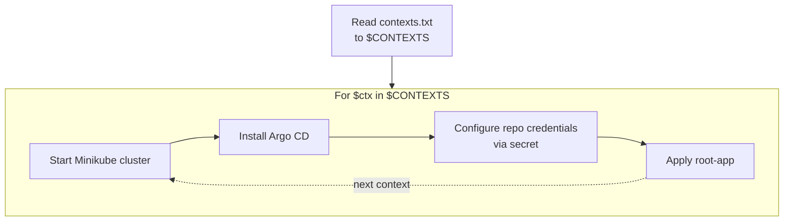

# ArgoCD Sandbox

This repository allows for quick setup of local kubernetes clusters and configuration of ArgoCD to use the app-of-apps GitOps approach.

> [!IMPORTANT]
> cluster = context = environment

## Table Of Contents

<!-- toc -->

- [Requirements](#requirements)
  * [Packages](#packages)
  * [SSH Key](#ssh-key)
- [Quick Start](#quick-start)
- [Setup](#setup)
  * [Contexts](#contexts)
  * [Diagram](#diagram)
- [Access ArgoCD UI](#access-argocd-ui)
  * [Initial Admin Password](#initial-admin-password)
  * [Port Forwarding Service](#port-forwarding-service)
- [Adding Apps](#adding-apps)
  * [YAML Based Apps](#yaml-based-apps)
  * [Helm Based Apps](#helm-based-apps)
    + [Remote Charts](#remote-charts)
  * [ArgoCD App Templating](#argocd-app-templating)
- [Tips](#tips)
  * [Alias](#alias)
  * [Check with k9s](#check-with-k9s)
- [Remove](#remove)
- [References](#references)

<!-- tocstop -->

## Requirements

### Packages

- [minikube](https://formulae.brew.sh/formula/minikube)

### SSH Key

In order to give ArgoCD access to this repo, you need to:

- configure SSH access to ***atc-github***
- create the private key, with the name ***argocd-ssh***, in `~/.ssh`.

> [!NOTE]
> You can duplicate your existing ssh private key and change its name:
> `cp ~/.ssh/<your-private-ssh-key> ~/.ssh/argocd-ssh`

## Quick Start

```sh
# Deploy sandbox
./setup.sh

# Get ArgoCD password
./pwd.sh
# Get the last one

# Port forward ArgoCD UI
kubectl port-forward --context cluster-prod svc/argocd-server -n argocd 8080:443
```

## Setup

To deploy the sandbox, make sure all the requirements are met and run [setup.sh](https://atc-github.azure.cloud.bmw/Extended-Enterprise-Catena-X/dsf-argo-sandbox/blob/master/setup.sh)

### Contexts

The [contexts.txt](https://atc-github.azure.cloud.bmw/Extended-Enterprise-Catena-X/dsf-argo-sandbox/blob/master/contexts.txt) file is used to define the contexts/clusters to be created by `setup.sh`

### Diagram



## Access ArgoCD UI

### Initial Admin Password

To get the initial admin password you can run [pwd.sh](https://atc-github.azure.cloud.bmw/Extended-Enterprise-Catena-X/dsf-argo-sandbox/blob/master/pwd.sh)

```sh
❯ ./pwd.sh
ArgoCD UI password for cluster-dev:
fw0kosWYIU0HiyX0

ArgoCD UI password for cluster-prod:
p9SYdMIvdIPktLCJ
```

### Port Forwarding Service

Then you can port-forward ArgoCD server service, of one or both clusters, to access UI:

```sh
kubectl port-forward --context cluster-dev svc/argocd-server -n argocd 8080:443
kubectl port-forward --context cluster-prod svc/argocd-server -n argocd 8081:443
```

## Adding Apps

### YAML Based Apps

For YAML Based Apps the following approach should be used:

```sh
nginx
├── base
│   ├── deployment.yaml
│   ├── kustomization.yaml
│   ├── namespace.yaml
│   └── service.yaml
└── overlays
    ├── cluster-dev
    │   ├── configMap.yaml
    │   └── kustomization.yaml
    └── cluster-prod
        ├── configMap.yaml
        └── kustomization.yaml
```

- a ***base***  directory, where we define the environment agnostic kubernetes resources
- a ***overlays*** directory, where we define environment specific kubernetes resources
- a ***kustomization.yaml*** file, both in base and overlays, that tells Kustomize how to build/manipulate Kubernetes resources

The pattern is to have a kustomization.yaml file in base directory and another in the overlays that references the base kustomization file and the overlay resources that are cluster specific.

> [!NOTE]
> Ultimately, when ArgoCD finds a kustomization file, it runs `kustomize build`, which generates the manifests.

Then, add an ArgoCD Application under `clusters/<cluster>`, as such:

```sh
cluster-prod
├── kustomization.yaml
└── nginx.yaml
```

Pointing the path to the right overlay, as such:

```yaml
source:
  repoURL: git@atc-github.azure.cloud.bmw:Extended-Enterprise-Catena-X/dsf-argo-sandbox.git
  targetRevision: master
  path: app-of-apps/apps/nginx/overlays/cluster-prod
```

And finally, add the app to ***kustomization.yaml*** under the environment for which we are configuring the app, so that ArgoCD can discover it:

```yaml
apiVersion: kustomize.config.k8s.io/v1beta1
kind: Kustomization
namePrefix: prod-
resources:
  - nginx.yaml
```

### Helm Based Apps

#### Remote Charts

For remote helm based Apps the following approach should be used:

```sh
nginx-helm
└── values
    ├── cluster-dev.yaml
    └── cluster-prod.yaml

```

Then, in the ArgoCD Application, we need to use multiple sources, one for the helm chart, and one for the values file, that resides in our repo:

```yaml
sources:
  - repoURL: https://charts.bitnami.com/bitnami
    chart: nginx
    targetRevision: 22.3.8
    helm:
      valueFiles:
        - $path/app-of-apps/apps/nginx-helm/values/cluster-prod.yaml
  - repoURL: git@atc-github.azure.cloud.bmw:Extended-Enterprise-Catena-X/dsf-argo-sandbox.git
    targetRevision: master
    ref: path
```

> [!NOTE]
> Without multiple sources, it can't load our custom valuesFile because it will look for it in the chart repo

And finally add the ApplicationSet to ***kustomization.yaml*** under the environment in which we are deploying the app, so that ArgoCD can discover it:

```yaml
apiVersion: kustomize.config.k8s.io/v1beta1
kind: Kustomization
namePrefix: prod-
resources:
  - nginx.yaml
  - nginx-helm.yaml <-
```

### ArgoCD App Templating

As an example for an application that needs to be deployed multiple times with different names/values, an  ApplicationSet named [edc.yaml](https://atc-github.azure.cloud.bmw/Extended-Enterprise-Catena-X/dsf-argo-sandbox/blob/master/app-of-apps/argocd/clusters/cluster-prod/edc.yaml) was created, for each environment.

> [!NOTE]
> This simulates different ***use-cases*** being deployed using the same codebase

Let's take the generators section of the ApplicationSet, being deployed in "cluster-prod" as example:

```yaml
generators:
  - git:
      repoURL: git@atc-github.azure.cloud.bmw:Extended-Enterprise-Catena-X/dsf-argo-sandbox.git
      revision: master
      files:
        - path: app-of-apps/apps/edc/cluster-prod/*.yaml
```

And then you can use the same logic as for the single helm application, in the sources section of the template:

```yaml
template:
  sources:
    - repoURL: https://charts.bitnami.com/bitnami
      chart: nginx
      targetRevision: 22.3.8
      helm:
        releaseName: "{{path.filename}}"
        valueFiles:
          - $path/app-of-apps/apps/edc/{{path.basename}}/{{path.filename}}
    - repoURL: git@atc-github.azure.cloud.bmw:Extended-Enterprise-Catena-X/dsf-argo-sandbox.git
      targetRevision: master
      ref: path
```

And finally add the ApplicationSet to ***kustomization.yaml*** under the environment in which we are deploying the app, so that ArgoCD can discover it:

```yaml
apiVersion: kustomize.config.k8s.io/v1beta1
kind: Kustomization
namePrefix: prod-
resources:
  - nginx.yaml
  - nginx-helm.yaml
  - edc.yaml  <-
```

This will create an ArgoCD Application for every values file found in `app-of-apps/apps/edc/cluster-prod`, deploying a release with the name of the file.

```sh
apps/edc/cluster-prod/
├── bblocks-nginx.yaml
└── dsf-nginx.yaml
```

## Tips

### Alias

In order to switch contexts easily you can use the following alias

```sh
alias kgc='kubectl config get-contexts'
alias kuc='kubectl config use-context'
```

### Check with k9s

If you don't have k9s you can install it with `brew install k9s`

If you want to check more than one context at the same time:

```sh
k9s --context cluster-dev
k9s --context cluster-prod
```

## Remove

In order to remove all local clusters created you can run [remove.sh](https://atc-github.azure.cloud.bmw/Extended-Enterprise-Catena-X/dsf-argo-sandbox/blob/master/remove.sh)

## References

- [ArgoCD Application Docs](https://argo-cd.readthedocs.io/en/latest/user-guide/application-specification/)
- [ArgoCD Helm](https://argo-cd.readthedocs.io/en/release-2.7/user-guide/helm/)
- [Helm value files from external Git repository](https://argo-cd.readthedocs.io/en/release-2.7/user-guide/multiple_sources/#helm-value-files-from-external-git-repository)
- [ArgoCD AppSet Git Generator](https://argo-cd.readthedocs.io/en/latest/operator-manual/applicationset/Generators-Git/)
